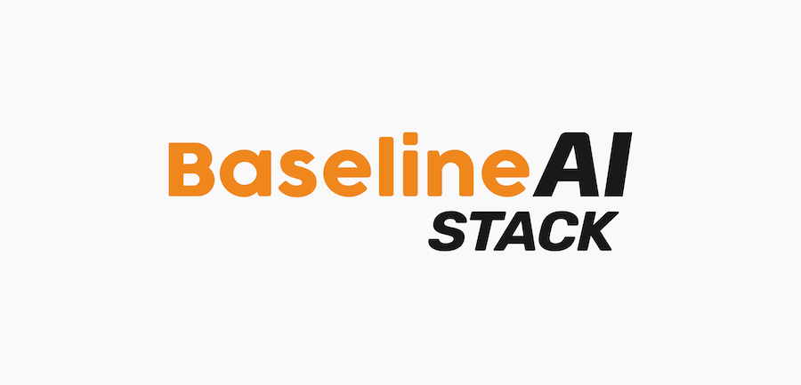

# Baseline AI Stack

BaselineJS AI Stack is an open-source, fullstack TypeScript, serverless first framework designed to make building cloud native applications easier. This is a customized version of BaselineJS that demonstrates how Bedrock AI can be integrated into the BaselineJS framework in a working application.

If you like BaselineJS give us a ⭐️

[Baseline AI Stack](https://github.com/Baseline-JS/baseline-ai-stack)

[Website](https://baselinejs.com/) |
[Documentation](https://docs.baselinejs.com/) |
[Discord](https://discord.gg/beCj9VDeMm) |
[LinkedIn](https://www.linkedin.com/company/baselinejs) |
[YouTube](https://www.youtube.com/@Baseline-JS)

Startups, want $10k USD of AWS Credits to Get Started? [Apply Here](https://share.hsforms.com/1P6p_G9Q_Q-SJAESAYtLftgqm3as)

# Getting Started

## Setup

1. [Install requirements](#local-requirements) `pnpm run install:requirements`
2. `npx @baselinejs/create-ai-stack`
3. `pnpm install`
4. `pnpm run setup` to name your project and set the region
5. `pnpm run aws:profile` to setup your AWS credentials profile (if you have issues please [update aws cli](https://docs.aws.amazon.com/cli/latest/userguide/getting-started-install.html]))
6. `pnpm run deploy:staging` to deploy api & chat
7. `pnpm run add:user:staging` to add a chat user to the application
8. `pnpm run urls:staging` To see your project URLs

### Setup the AI settings

`packages/api/src/baseblocks/chat/chat-api.ts` contains the settings for the AI model. Set them to the desired values. Deploy the application again after changing these settings with `pnpm run deploy:staging`.

The settings are as follows:

```typescript
const MODEL_REGION = 'ap-southeast-2';
const MODEL_ID = ModelIdentifiers.MISTRAL_MISTRAL_7B_INSTRUCT_V0;
const MAX_INPUT_TOKENS = 1000;
const MAX_OUTPUT_TOKENS = 1000;
const MAX_COMPUTE_MS = 10000;
const MAX_TOTAL_TOKENS = 0; // No limit
const GLOBAL_MAX_INPUT_TOKENS = 100000;
const GLOBAL_MAX_OUTPUT_TOKENS = 100000;
const GLOBAL_MAX_COMPUTE_MS = 1000000;
const GLOBAL_MAX_TOTAL_TOKENS = 0; // No limit
```

Explanation of the settings:

- `MODEL_REGION`: The region of the AI model.
- `MODEL_ID`: The ID of the AI model. [See the Bedrock AI docs for list](https://docs.aws.amazon.com/bedrock/latest/userguide/model-ids.html).
- `MAX_INPUT_TOKENS`: The maximum number of tokens in the input to the AI model.
- `MAX_OUTPUT_TOKENS`: The maximum number of tokens in the output from the AI model.
- `MAX_COMPUTE_MS`: The maximum time in milliseconds the AI model can take to compute.
- `MAX_TOTAL_TOKENS`: The maximum number of tokens in the input and output combined.
- `GLOBAL_MAX_INPUT_TOKENS`: The maximum number of tokens in the input to the AI model for all users combined.
- `GLOBAL_MAX_OUTPUT_TOKENS`: The maximum number of tokens in the output from the AI model for all users combined.
- `GLOBAL_MAX_COMPUTE_MS`: The maximum time in milliseconds the AI model can take to compute for all users combined.
- `GLOBAL_MAX_TOTAL_TOKENS`: The maximum number of tokens in the input and output combined for all users combined.

Set any of them to 0 to disable the limit.

The user and global limits will be enforced by the API. If the limits are exceeded, the API will return an error. The user limits are enforced per user, and the global limits are enforced for all users combined. A DynamoDB table is used to store the usage of each user as well as the default values, that way any user can be tracked and the limits can be enforced as well as modified.

## Local Requirements

These must be installed before following the setup instructions.

- Macos/Linux OS/Windows Subsystem for Linux
  - Node.js v20 (v20 or higher) & npm@10.5.0 or higher [(we suggest installing and using nvm)](https://github.com/nvm-sh/nvm#install--update-script) follow instructions in the link to install, you will generally need to create a new terminal session after installing. If you already have nvm update it before proceeding.
    - If nvm is installed you can switch versions with `nvm install 20 && nvm use 20 && nvm alias default 20 && nvm install-latest-npm`
    - If not using nvm you can manually install node and npm, download from <https://nodejs.org/en/download/> alternatively use the operating system package manager or any other appropriate tool to install node
    - Current versions can be checked with `node -v`, `npm -v`
  - pnpm version 9, version can be checked with `pnpm -v`, install with `npm install -g pnpm@9` [or other methods](https://pnpm.io/installation)
  - [AWS CLI v2](https://aws.amazon.com/cli)
  - Homebrew, for Mac users only, follow install instructions [here](https://brew.sh/)
  - [jq](https://stedolan.github.io/jq/download/) for extracting Cloudformation outputs
    - Install on mac `brew install jq`
    - Install on Linux `sudo yum install jq` or `sudo apt-get install jq`, or other appropriate methods
  - Java Runtime Environment (JRE) version 8.x or newer, it is only required for [DynamoDB local](https://docs.aws.amazon.com/amazondynamodb/latest/developerguide/DynamoDBLocal.html)
    - Install on mac `brew install java`
    - Install on linux `sudo yum install java` or `sudo apt-get install openjdk-8-jdk`, or other appropriate methods
    - DynamoDB local will automatically install in the project when the api is started, java needs to installed before this occurs
  - curl which is used in some of the bash scripts, [curl install instructions](https://everything.curl.dev/get)
  - An IDE such as [Visual Studio Code](https://code.visualstudio.com/)
- Internet connectivity
- AWS Account <https://aws.amazon.com/getting-started/>
- IAM credentials <https://docs.aws.amazon.com/cli/latest/userguide/getting-started-prereqs.html#getting-started-prereqs-iam> be sure to follow [Security best practices in IAM](https://docs.aws.amazon.com/IAM/latest/UserGuide/best-practices.html)

### Experimental Requirements Installation

Alternatively, try the experimental requirements installation script. Use at your own risk.

If you are starting a new Baseline project.

```bash
curl -o- https://raw.githubusercontent.com/Baseline-JS/core/main/scripts/experimental-install-requirements.sh | bash
```

or

```bash
wget -qO- https://raw.githubusercontent.com/Baseline-JS/core/main/scripts/experimental-install-requirements.sh | bash
```

If you are joining an existing Baseline project

```bash
pnpm run install:requirements
```

## Run Locally

If the project is already setup and you are trying run the project locally make sure you run `pnpm run aws:profile` first so that you have the correct credentials for AWS configured locally.

### Commands

Start the api and chat in their own terminal windows/tabs with the following commands.

1. `pnpm run generate:env:local` to generate the env files for the frontend clients
2. `pnpm run start:api`
3. `pnpm run start:chat`

### Running locally Limitations

- API, Chat: No S3, you will need to rely on AWS staging S3
- API: No local Cognito Authorizer, the deployed staging cognito can be used (see `packages/api/serverless.yml`) or the payload set by `AUTHORIZER` in `packages/api/scripts/run-api-local.sh`.
- Chat: Cognito UI relies on an active AWS Cognito user pool, use deployed staging

## Deploy a Change

Swap `staging` to `prod` to deploy to production. All environment variables will be automatically set in the process.

1. `pnpm run deploy:staging` to deploy api and chat

## Remove Stack

To destroy the deployed cloudformation stacks so it is no longer on AWS run `pnpm run remove:staging`. This will likely destroy all data associated with the application.

## Major Components

- 🚀 API
- 🌐 React User Application
- ⚙️ CI/CD
- 🔧 Developer Tooling
- 🔒 Authentication
- 🔄 Multiple Environments
- 💻 Run Locally
- 🏗️ Infrastructure as Code (IaC)
- 📦 Managed Environment Variables
- ✨ Baseline Commands

## Technology

- 🎁 Package Management: Pnpm + Monorepo
- 🔨 Language & Build: TypeScript + ESBuild
- 🖼 Frontend: React + Vite
- ⚙️ Backend: NodeJS + Express
- 🎨 Linting & Formatting: Prettier + Eslint
- 🏗 IaC: AWS + Serverless Framework
- 🚀 Deploy: Local/Bitbucket/GitHub CI/CD

## AWS Services

- Cognito
- S3
- Lambda
- DynamoDB
- CloudFormation
- Route53
- Systems Manager
- CloudFront
- API Gateway
- CloudWatch
- SNS

## What can you build with Baseline?

- 🌐 SaaS Solutions: Build software-as-a-service solutions tailored to your audience.
- 🖥️ Web Applications: Develop responsive and scalable web applications.
- 🛒 Marketplaces: Launch and manage online marketplaces with ease.
- 📱 Mobile Applications: Create robust mobile apps for iOS and Android platforms.
- 💼🛍️ B2B/B2C Applications: Seamlessly cater to both business and consumer audiences.
- 🗄️ Headless CMS: Manage content efficiently using a headless content management system.

## Benefits

- Serverless First
- Open source
- Full control
- Cost effective implementation
- Hosted in your own AWS account
- Uses popular technology
- Scales on demand
- Staging and production environments
- Runs locally

# Baseline

If you would like to learn more about what we do please visit [Baseline](https://baselinejs.com/)
